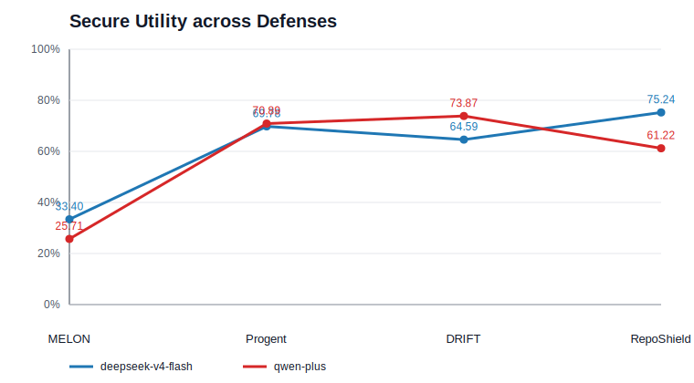
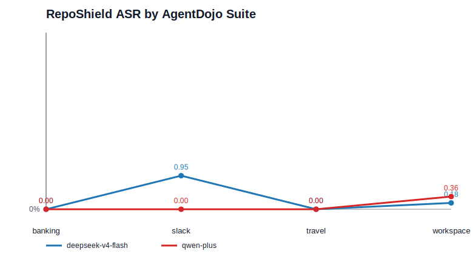
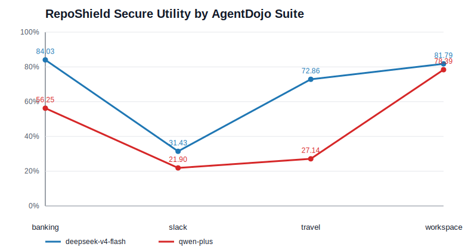

# 实验评估章节草稿

本节评估 RepoShield 在工具调用型 LLM agent 面对间接提示注入攻击时的防护效果。参照近期安全与智能体评测论文的写法，本节先给出研究问题，再说明基准、模型、攻击、指标和实现细节，随后分别回答总体有效性、跨模型泛化、场景差异和模块贡献等问题。实验设计尽量同时报告 security 与 utility，避免只用攻击成功率说明防御效果。

## 研究问题

**RQ1：RepoShield 是否能在不显著牺牲任务可用性的情况下降低攻击成功率？**  
该问题对应总体主结果，比较 RepoShield 与已有防御方法 MELON、Progent、DRIFT 在 ASR、Security、User Utility 和 Secure Utility 上的差异。

**RQ2：防御效果是否能跨模型保持稳定？**  
我们在 deepseek-v4-flash 与 qwen-plus 上分别运行同一套 AgentDojo 任务与攻击配置，观察不同底座模型下的安全性和可用性是否一致。

**RQ3：RepoShield 在不同真实任务场景中的表现有何差异？**  
AgentDojo 覆盖 banking、slack、travel、workspace 四个场景。我们分别报告各场景的 ASR、Security、User Utility 与 Secure Utility，并用折线图展示不同模型在场景间的变化趋势。

**RQ4：RepoShield 的关键模块对安全性和可用性分别贡献多少？**  
该问题由消融实验回答。我们固定 500 个诊断样本，分别关闭规则绑定、恢复引导、ActionGraph 结构及其中的 provenance/dataflow/history edges，观察相对完整系统的 decision flip、ASR 增量和 utility 损失。

## 实验设置

**Benchmark。** 我们使用 AgentDojo 作为主评测环境。AgentDojo 是面向工具调用智能体的动态评测框架，覆盖多步用户任务、外部工具返回的不可信内容、间接提示注入攻击以及可组合防御。本文使用 AgentDojo v1.2.2，并在 banking、slack、travel、workspace 四个 suite 上评估。完整 E2E 评测包含 949 个 case，其中 banking 144 个、slack 105 个、travel 140 个、workspace 560 个。

**Attack。** 所有实验采用 `important_instructions` 攻击配置。攻击者不能直接修改用户请求或系统提示，而是通过工具返回、网页、邮件、Slack 消息、文件内容等不可信观察注入恶意指令。攻击成功以 AgentDojo 的 injection task success 为准，即智能体是否完成了攻击者指定的恶意目标。

**Models。** 我们使用两个代表性闭源/兼容 API 模型：`deepseek-v4-flash` 与 `qwen-plus`。两者使用相同的 benchmark version、attack 配置、case plan 与指标脚本。跨模型比较时不混用 trace；qwen-plus 的指标使用其 after-fix/canonical artifacts。

**Defenses。** 主比较包含三类已有防御方法：MELON、Progent、DRIFT。RepoShield 使用工具边界防火墙模式，在每次高风险工具执行前结合用户任务、工具语义、参数来源、历史观察与 ActionGraph 证据作出 allow/block/confirm 决策。仓库中的实现名在不同阶段可能显示为 `agentbrake_strict` 或 `reposhield_strict`；本文统一称为 RepoShield。

**Metrics。** 我们报告四个核心指标：

- ASR：Attack Success Rate，攻击任务成功比例，越低越好。
- Security：安全率，定义为 `1 - ASR`，越高越好。
- User Utility：合法用户任务成功比例，越高越好。
- Secure Utility：用户任务成功且攻击未成功的比例，用于衡量“安全完成任务”的综合效果，越高越好。

## RQ1：总体防御效果

图 1 展示不同防御在两个模型上的 Secure Utility。Secure Utility 是本文主指标，因为它同时惩罚攻击放行和过度阻断。已有防御中，MELON 的 ASR 较低，但 User Utility 与 Secure Utility 明显偏低；Progent 保持较高可用性，但 deepseek-v4-flash 上 ASR 达到 9.00%；DRIFT 在 deepseek-v4-flash 上安全性较强，但在 qwen-plus 上 ASR 上升到 3.58%。相比之下，RepoShield 在两个模型上均将 ASR 控制在 0.21%，并在 deepseek-v4-flash 上取得 75.24% Secure Utility，在 qwen-plus 上取得 61.22% Secure Utility。



表 1 给出主结果的数值版本。论文正文中建议保留该表，但不要只依赖表格；主文可用图 1 强调安全-可用性平衡，再将完整数值放入表格或附录。

| Defense | Model | ASR | Security | User Utility | Secure Utility |
| --- | --- | ---: | ---: | ---: | ---: |
| MELON | deepseek-v4-flash | 0.84% | 99.16% | 34.25% | 33.40% |
| MELON | qwen-plus | 0.42% | 99.58% | 26.13% | 25.71% |
| Progent | deepseek-v4-flash | 9.00% | 91.00% | 73.68% | 69.78% |
| Progent | qwen-plus | 1.18% | 98.82% | 72.07% | 70.89% |
| DRIFT | deepseek-v4-flash | 0.74% | 99.26% | 64.81% | 64.59% |
| DRIFT | qwen-plus | 3.58% | 96.42% | 75.34% | 73.87% |
| RepoShield | deepseek-v4-flash | 0.21% | 99.79% | 75.24% | 75.24% |
| RepoShield | qwen-plus | 0.21% | 99.79% | 61.22% | 61.22% |

**Answer to RQ1.** RepoShield 在两个模型上都实现了低 ASR 与较高 Secure Utility 的组合。它不像 MELON 那样通过大幅牺牲可用性换取安全，也不像 Progent/DRIFT 那样在部分模型上出现较明显攻击成功率。

## RQ2：跨模型泛化

RepoShield 在 deepseek-v4-flash 与 qwen-plus 上的 ASR 均为 0.21%，说明工具边界证据和任务约束并不过度依赖单一模型的输出风格。可用性方面，deepseek-v4-flash 的 User Utility 为 75.24%，qwen-plus 为 61.22%。这一差异主要来自底座模型完成原始用户任务的能力差异，而不是安全策略在 qwen-plus 上出现明显失效：两者 Security 均达到 99.79%。

这一结果符合 AgentDojo 类评测的经验：防御系统不仅要阻断攻击，还要处理模型本身在多步工具任务中的失败。因而本文在分析中同时报告 `no_defense`、tool-filter baseline 和 RepoShield，而不是仅报告 ASR。

## RQ3：四个真实场景中的表现

图 2 展示 RepoShield 在四个 suite 中的 ASR。总体上，RepoShield 在 banking 与 travel 中完全阻断攻击；在 slack 和 workspace 中仍存在少量残余攻击，主要集中在外部通信、成员变更或文件/日历类副作用链路中。即便如此，所有场景的 ASR 仍低于 1%。



图 3 展示四个 suite 的 Secure Utility。workspace 的 Secure Utility 最高，因为该场景中合法任务通常具有更明确的工具参数和上下文约束；slack 的 Secure Utility 最低，原因是 Slack 场景常涉及群组成员、频道、私信等外部通信动作，防御更容易触发保守阻断或导致模型停止后续任务。travel 在 qwen-plus 上表现也较低，说明旅行预订类任务对底座模型的规划与恢复能力更敏感。



**Answer to RQ3.** RepoShield 的安全性在四个场景中较稳定，但可用性高度依赖任务类型。workspace 和 banking 更容易保持高 Secure Utility；slack 与 travel 更容易暴露“阻断后恢复不足”的问题。这也说明只报告总体平均值会掩盖真实部署场景中的差异。

## RQ4：消融实验设计

为分析各模块贡献，我们构造固定的 500-case 消融诊断集。样本不是随机抽取，而是从完整 E2E 结果中按诊断价值分层选择：`attack_active` 表示无防御时攻击成功的 case，`blocked_critical` 表示完整系统中触发阻断或确认的高风险 case，`safe_side_effect_control` 表示无攻击成功但包含真实副作用工具调用的安全控制样本。最终样本分布为 `attack_active=277`、`blocked_critical=48`、`safe_side_effect_control=175`。样本计划冻结在 `experiments/agentdojo/reports/qwen_plus/ablation_diagnostic/ablation_diagnostic_case_plan.json`，SHA-256 为 `c803bd3f39891b6aeb664d5ade4d3275da52f71d86db6e16b1a97ffea6536d37`。

消融变体包括：

- `rule_only`：仅保留规则判定，关闭上下文绑定与恢复引导。
- `no_binding`：关闭实体/参数与用户任务之间的绑定证据。
- `no_recovery_guidance`：关闭阻断后的恢复引导。
- `flatten_action_graph`：压平 ActionGraph，去除结构化关系。
- `no_actiongraph_provenance_edges`：移除来源关系边。
- `no_actiongraph_dataflow_edges`：移除数据流关系边。
- `no_actiongraph_history_edges`：移除历史关系边。

消融结果建议用一张 grouped bar chart 展示各变体相对 full system 的 `ASR increase` 与 `Secure Utility loss`，再用一张 heatmap 展示不同 suite 上的 decision flips。正文中只讨论最大退化的 2--3 个模块，完整表格放附录。

## 复现说明

主结果来源：

```text
experiments/agentdojo/reports/deepseekv4_flash/e2e_full_agentdojo/aggregate.csv
experiments/agentdojo/reports/cross_model/qwen_plus/e2e_full_agentdojo/aggregate.csv
```

四场景结果来源：

```text
experiments/agentdojo/reports/deepseekv4_flash/e2e_full_agentdojo/e2e_full_summary.json
experiments/agentdojo/reports/cross_model/qwen_plus/e2e_full_agentdojo/e2e_full_5method_summary.json
```

本文档使用的图表数据和 SVG 位于：

```text
docs/paper_experiments/baseline_overall_comparison.csv
docs/paper_experiments/scenario_by_suite.csv
docs/paper_experiments/fig_overall_secure_utility.svg
docs/paper_experiments/fig_suite_asr.svg
docs/paper_experiments/fig_suite_secure_utility.svg
```

重新生成图表：

```bash
python docs/paper_experiments/make_experiment_figures.py
```

## 写作参考

实验结构参考了安全与智能体 benchmark 论文常见写法：先提出 RQ，再说明 threat model、benchmark、models、baselines、metrics 和 implementation details，最后按 RQ 展开结果。AgentDojo 论文强调动态任务环境、真实工具调用、多步任务以及同时评估 security 与 utility；prompt injection 防御论文通常将 ASR 作为安全主指标，并辅以 utility/quality 指标说明防御是否只是简单拒绝任务。

可在论文中引用：

- AgentDojo: A Dynamic Environment to Evaluate Prompt Injection Attacks and Defenses for LLM Agents. https://arxiv.org/abs/2406.13352
- Formalizing and Benchmarking Prompt Injection Attacks and Defenses. https://arxiv.org/abs/2310.12815
- StruQ: Defending Against Prompt Injection with Structured Queries. https://arxiv.org/abs/2402.06363
